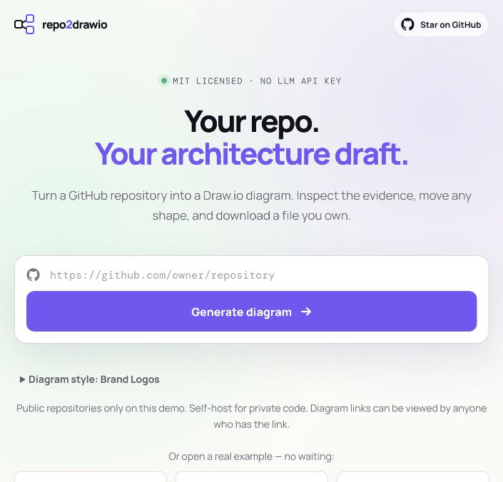
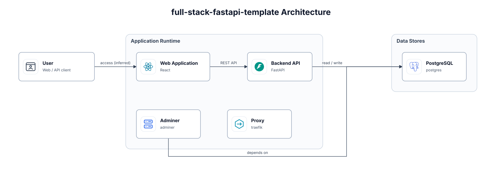

# repo2drawio

**Turn a GitHub repository into an editable Draw.io architecture draft. No LLM API key.**

Paste a repository URL, inspect inferred components and their source evidence,
then move, relabel, reconnect, and download native Draw.io shapes. MIT licensed.



*A 20-second sequence of three actual UI captures: home, example, edited local copy.
It is not a real-time recording or a generation-speed claim.*



*Unmodified output from [FastAPI's full-stack template](https://github.com/fastapi/full-stack-fastapi-template/tree/cb740b656d7a0a6c5e12c7bf8e50343ec94ee9c7).
A dependency-level draft, not a complete deployment or call graph.*

## Try it

```bash
git clone https://github.com/ardkyer/repo2drawio.git
cd repo2drawio
docker compose up --build
```

Open [localhost:8000](http://localhost:8000). Paste a public repository URL, or open
one of the three instant examples. Examples need no GitHub access or sign-up.
Edit an example and download your own copy; the original stays unchanged.

A public hosted URL is not available yet. Local instructions are the working entry
point until deployment is complete.

| Real public example | What the draft captures | What to review |
| --- | --- | --- |
| [FastAPI + React](src/repo2drawio/static/examples/fastapi.drawio) | Web app, API, PostgreSQL, Compose services | Proxy routing and Compose overrides |
| [Docker voting app](src/repo2drawio/static/examples/voting.drawio) | Vote/result services, worker, Redis, PostgreSQL | Message direction; optional seed profile |
| [Celery + Flower](src/repo2drawio/static/examples/flower.drawio) | Worker, Flower, Redis, monitoring dependencies | Celery message flow and Prometheus scraping |

All three outputs are generated without manual corrections. Source commits and caveats
are in [the example catalog](src/repo2drawio/static/examples/index.json).

## Why use it?

- **Native .drawio output:** shapes, labels, icons, groups, and connectors remain editable.
- **No LLM API key:** the web analyzer uses manifests, Compose, and selected source patterns.
- **Reviewable evidence:** detected elements retain source paths and line references.
- **Self-hostable:** read public or explicitly authorized private repositories on your own instance.
- **Portable files:** SVG previews and embedded icons; no account with this project required.

The web reader does not install repository dependencies or execute repository code.
It skips common secret files, binaries, generated data, and test fixtures, with
archive/file/text limits. It is not a secret scanner.

## Supported scope and limitations

Best results come from supported web frameworks and Docker Compose deployments:
React/Next.js/Vue/Svelte/Angular, Express/NestJS/Fastify/Koa, and selected Python stacks
including FastAPI, Django, Flask, Airflow, and Streamlit when recognizable manifests
and runtime entry points are present.

**Generation success is not architecture accuracy.** Detection is heuristic. A library
may be mistaken for an application; unsupported layouts may collapse into two boxes.
Multiple independent Compose projects may be conflated. Compose overrides, profiles,
runtime traffic, full call graphs, and arbitrary business workflows are not resolved.
Some detailed capability rules target specific naming conventions rather than general
semantic understanding. Dependencies do not prove runtime calls. Review the result.

We ran a [10-repository public smoke audit](docs/public-repository-audit.md), including
sparse and misleading results. This is not a representative accuracy benchmark.

Three styles are available: Brand Logos, Icon Sketch, and Classic. Brand assets are
embedded after retrieval from pinned Simple Icons versions. The embedded editor loads
from embed.diagrams.net and receives diagram XML in the browser; this experience is
not fully offline. Downloaded files can be used with your preferred Draw.io installation.

## Private repositories and diagram links

Use a trusted HTTPS instance or self-host locally. Create a fine-grained PAT limited
to the repository, with **Contents: Read-only**. For organization repositories, select
the organization as Resource owner; administrator approval may be needed.

The PAT is used for that job and is not persisted in artifacts or job metadata.
**Anyone with a generated diagram URL can view its contents.** An edit URL additionally
grants permission to save changes. These are link-based capabilities, not authenticated
private documents. Do not share private diagrams or edit URLs unintentionally.

Public demo deployments can disable PAT entry using REPO2DRAWIO_ALLOW_PRIVATE=false.

## Run without Docker

Requires Python 3.11+:

```bash
python -m venv .venv
source .venv/bin/activate
python -m pip install -e '.[dev]'
repo2drawio-web
```

| Variable | Default | Purpose |
| --- | --- | --- |
| HOST / PORT | 127.0.0.1 / 8000 | HTTP listener |
| REPO2DRAWIO_DATA_DIR | .repo2drawio-data | Persistent job files |
| REPO2DRAWIO_WORKERS | 2 | Concurrent analyses |
| REPO2DRAWIO_MAX_PENDING | 8 | Running + queued jobs |
| REPO2DRAWIO_MAX_JOBS | 500 | Stored job admission cap; no automatic deletion |
| REPO2DRAWIO_RATE_LIMIT | 3 | Job requests per client IP per 60 seconds |
| REPO2DRAWIO_ALLOW_PRIVATE | true | Allow explicitly supplied PATs |

Limits apply to one process. See [deployment notes](docs/deployment.md) before exposing
an instance to the Internet. API documentation: [localhost:8000/api/docs](http://localhost:8000/api/docs).

## CLI and agent workflow

The CLI renders an architecture JSON model; it does not itself scan a URL:

```bash
repo2drawio init architecture.json
repo2drawio validate architecture.json
repo2drawio render architecture.json --drawio architecture.drawio --svg architecture.svg
```

Stable semantic IDs preserve manual positions, labels, and styles when regenerating
from an updated model. The web UI does not yet update an existing diagram from a newer commit.

An optional [coding-agent skill](skills/repo2drawio/SKILL.md) lets an agent inspect a local
repository and supply the architecture model. That workflow uses your existing agent;
the standalone web analyzer does not call an LLM. See the [schema](schema/architecture.schema.json).

## Contribute

Found a wrong connection? [Open an issue](https://github.com/ardkyer/repo2drawio/issues/new/choose)
with a public repo, commit, and supporting source path. See [CONTRIBUTING.md](CONTRIBUTING.md).
If this saves you time, a GitHub star helps other developers discover it.

```bash
python -m unittest discover -s tests -v
```

Next priorities: better framework-independent detection, separate views for independent
Compose projects, and updating a diagram while keeping human edits. MIT license;
[third-party notices](THIRD_PARTY_NOTICES.md) apply to embedded brand assets.
